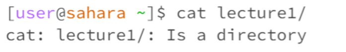
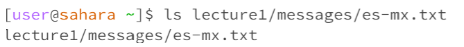
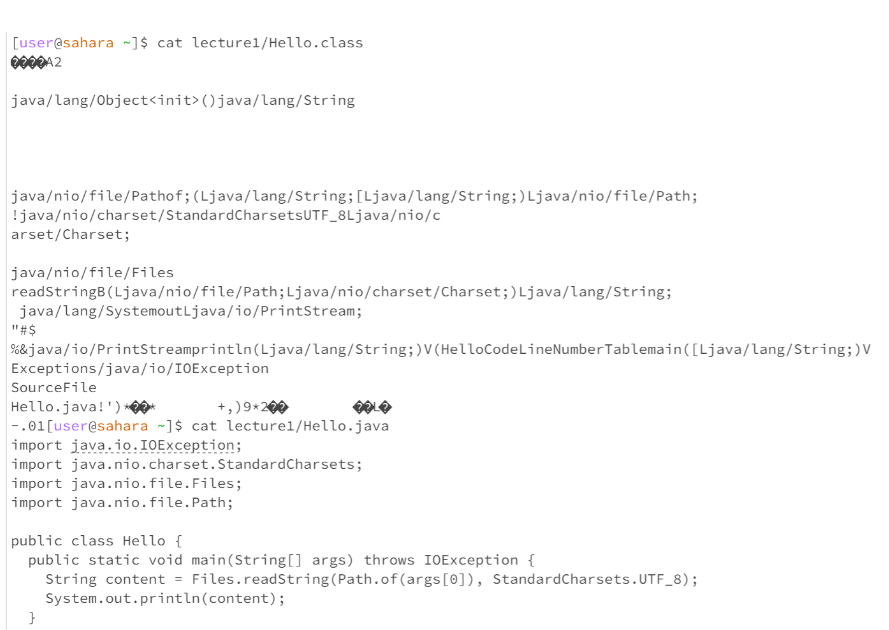

# Lab 1
## an example of using the command with no arguments

* When running `cd` with no argument brings you to the home directory and there is no output

* When running `ls` with no argument the output was `lab1` `lecture1` because `ls` lists all the directories and files under `/home`

* When running `cat` with no argument goes into state where it return what you just type
## an example of using the command with a path to a directory as an argument

* When running `cd` with a directory `lecture 1` and `messages` as an argument it goes to `messages` directory under the `lecture 1` directory and it becomes the working directory 

* When running `ls` with a directory `lecture 1` as an argument it lists all the files and directory (in blue) under `lecture 1`
  
* Error: when running `cat` with a directory `lecture 1` as an argument it returns an error because cat concatenates for files and not directories 
## an example of using the command with a path to a file as an argument

* Error: when running `cd` with the argument file `ar-dz.txt` it returns that it is not a directory becuase cd only changes it working directory and not files

* Error: when running `l`s with the argument file `es-mx.txt` it is an error becuase ls only works on working directories 
  
* when running `cat` it returns the content of the file
  
