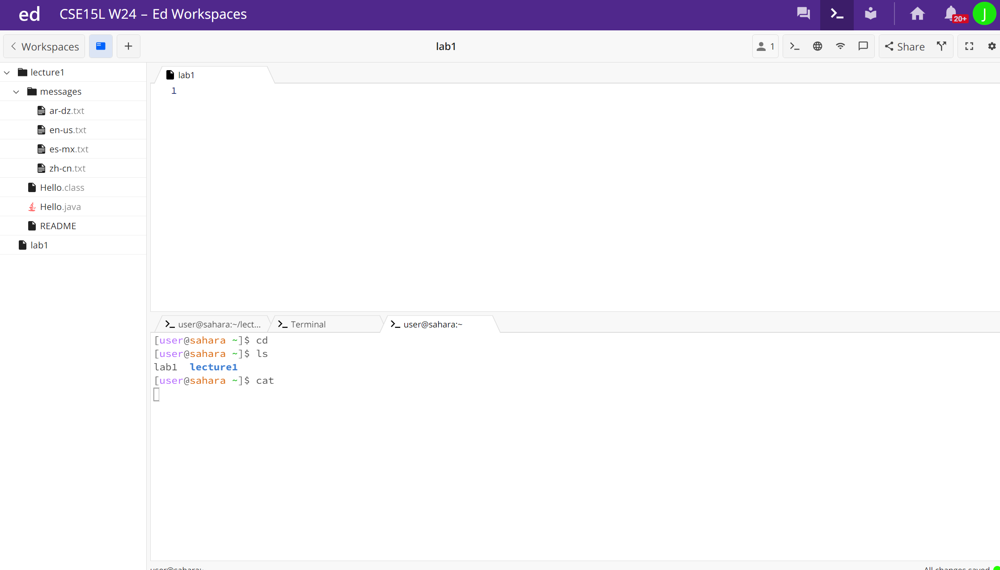
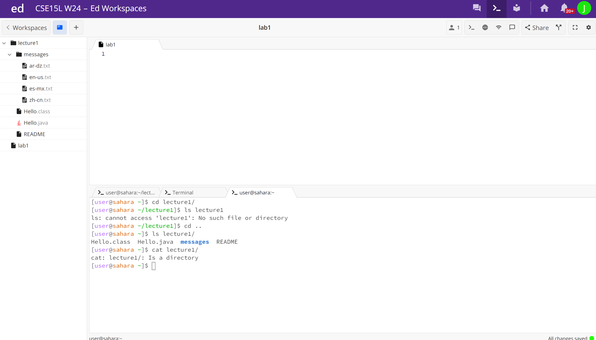

# Lab 1
## an example of using the command with no arguments

* When running cd with no argument brings you to the home directory 
* When running ls with no argument the output was lab1 lecture1 because ls lists all the directories and files under /home
* When running cat with no argument goes into state where it return what you just types for example if you type hi it will return hi 
## an example of using the command with a path to a directory as an argument

* When running cd with a directory lecture 1 as an argument it goes to lecture 1 directory
* When running ls with a directory lecture 1 as an argument it lists all the file under lecture 1
* when running cat with a directory lecture 1 as an argument it returns the lecture 1 is a directory
## an example of using the command with a path to a file as an argument
  [Image](sc3.png)
* When runnign cd with the argument file en-us.txt it returns that it is not a directory becuase cd on changes directory and not files
* When running ls with the argument file en-us.txt it returns en-us.txt
* when running cat it retuns what was in the file 
  
